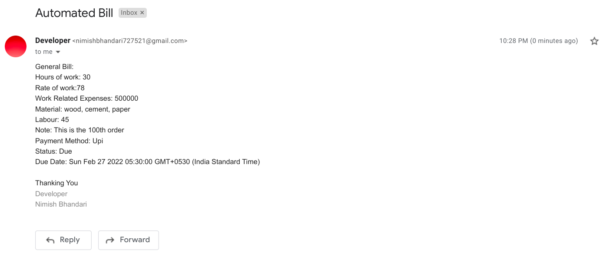

# TaxAdda Backend Assignment

This has covered all the features: <br> 

 - Create a new invoice
 - Add line items to the invoice. Line items may include hours of work at a certain rate, work-related expenses, materials, labor, etc.
 - Add notes to the invoice, including possibly how to pay it, where to send checks, etc.
 - Ability to update the status of the invoice
 - Send the invoice via email
 - View invoices including status (paid, outstanding, late, etc.)
 - Add a due date to an invoice
 - View late invoices, or even better, alert when an invoice is late
 - API Documentation
 - Data Validation


## Setup

### Add a .env file in root folder with the following

> copy example.env.txt as .env

##


## Install Dependencies

```bash
npm install
```

## Starting the project

```bash
npm start
```

<br>

## > Create a new Invoice

### Endpoint

> (POST) http://localhost:5000/api/invoice

```json
{
  "hoursOfWork": "30",
  "rateOfWork": "78",
  "workRelatedExpenses": "500000",
  "materials": "wood, cement, paper",
  "labor": "45",
  "notes": "This is the 100th order",
  "paymentMethod": "Upi",
  "customerEmail": "nimishbhandari727521@gmail.com",
  "status": "Due",
  "dueDate": "2022-02-27"
}
```

<br>

## > Update Invoice by ID

### Endpoint

> (PUT) http://localhost:5000/api/invoice/:id

(Anything Including Status can be updated from this endpoint) <br>
Example:

```json
{
  "hoursOfWork": "30",
  "status": "Due",
  "dueDate": "2022-02-27"
}
```

<br>

## > Send Invoice In Email to customer by ID

### Endpoint

> (POST) http://localhost:5000/api/invoice/:id



<br>

## > Get All Invoices

### Endpoint

> (GET) http://localhost:5000/api/invoice

<br>

## > Get All Late Invoices

### Endpoint

> (GET) http://localhost:5000/api/invoice/late
